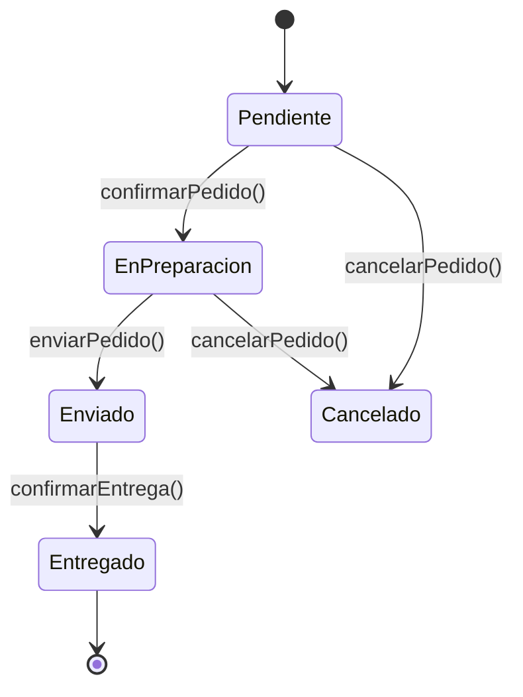
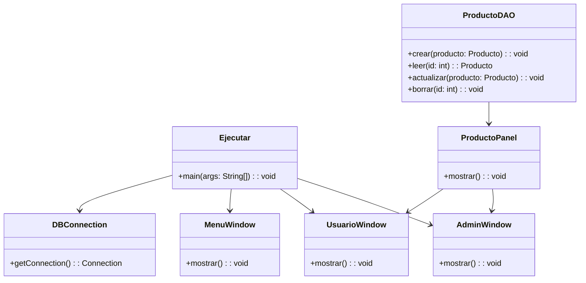

# Plataforma Web TabacApp

## 1. Descripción General

TabacApp es una plataforma web para la gestión integral de una tienda de tabaco y productos relacionados. Los usuarios podrán consultar productos, realizar pedidos y acceder a promociones. Los empleados tendrán funcionalidades para gestionar inventarios, ventas y clientes. Los administradores podrán administrar usuarios, productos y estadísticas de ventas.

## 2. Objetivos del Proyecto

| **ID**  | **Objetivo SMART**                                                                                 | **Tipo**    | **Métrica**                       | **Fecha Límite** | **Responsable**      | **Estado**    |
|---------|--------------------------------------------------------------------------------------------------|-------------|----------------------------------|------------------|----------------------|--------------|
| OBJ-01  | Implementar sistema de gestión de productos con alta precisión en inventario en 2 meses.         | Estratégico | % funcionalidades implementadas   | 2025-07-15       | Equipo de Desarrollo  | No iniciado  |
| OBJ-02  | Desarrollar módulo de gestión de usuarios con roles y autenticación segura antes de 3 meses.     | Operativo   | % usuarios con acceso controlado  | 2025-07-30       | Equipo de Desarrollo  | No iniciado  |
| OBJ-03  | Integrar sistema de pedidos online con confirmación en tiempo real en 2 meses.                   | Estratégico | Número de pedidos procesados      | 2025-07-20       | Equipo de Desarrollo  | En progreso  |
| OBJ-04  | Implementar panel administrativo para estadísticas y gestión de promociones en 3 meses.         | Táctico     | Funcionalidades disponibles       | 2025-08-01       | Equipo de Producto    | No iniciado  |
| OBJ-05  | Garantizar disponibilidad del sistema del 99.5% mensual con monitoreo activo.                    | No funcional| % uptime                         | 2025-08-15       | Equipo de Infraestructura | No iniciado  |

## 3. Requisitos Funcionales

| **ID**  | **Descripción**                                                           | **Prioridad** | **Fuente**           | **Estado**  |
|---------|---------------------------------------------------------------------------|---------------|----------------------|-------------|
| RF-01   | Gestión completa de productos: añadir, modificar, eliminar y listar.      | Alta          | Análisis interno     | Propuesto   |
| RF-02   | Control de inventario en tiempo real con alertas de stock bajo.           | Alta          | Análisis interno     | Propuesto   |
| RF-03   | Registro y autenticación de usuarios con roles (admin, cliente, empleado).| Alta          | Análisis interno     | Propuesto   |
| RF-04   | Sistema de pedidos online con seguimiento y confirmación inmediata.       | Alta          | Análisis interno     | Propuesto   |
| RF-05   | Panel administrativo para gestión de promociones y estadísticas.          | Media         | Análisis interno     | Propuesto   |
| RF-06   | Notificaciones automáticas para promociones y alertas de inventario.      | Media         | Análisis interno     | Propuesto   |
| RF-07   | Generación de reportes de ventas y movimientos de inventario.             | Media         | Análisis interno     | Propuesto   |
| RF-08   | Soporte para múltiples dispositivos y navegadores (responsive design).    | Alta          | Análisis interno     | Propuesto   |

## 4. Requisitos No Funcionales

| **ID**  | **Descripción**                                           | **Categoría**   | **Métrica**                | **Nivel Objetivo** | **Comentarios**                      |
|---------|-----------------------------------------------------------|-----------------|----------------------------|--------------------|-------------------------------------|
| RNF-01  | Tiempo de respuesta de la aplicación menor a 200 ms       | Rendimiento     | Latencia                   | < 200 ms           | Medición con pruebas de carga        |
| RNF-02  | Disponibilidad del sistema ≥ 99,8 % mensual                | Disponibilidad  | % Uptime                   | ≥ 99,8 %           | Monitorización y alertas continuas   |
| RNF-03  | Uso obligatorio de HTTPS para todas las comunicaciones    | Seguridad      | Cifrado                   | TLS 1.2+           | Auditorías de seguridad periódicas  |
| RNF-04  | Interfaz accesible cumpliendo WCAG 2.1 nivel AA            | Usabilidad     | Puntuación auditoría       | Nivel AA           | Auditoría externa antes del lanzamiento |
| RNF-05  | Escalabilidad para al menos 10.000 usuarios concurrentes  | Escalabilidad  | Usuarios concurrentes      | ≥ 10,000           | Arquitectura escalable en la nube    |
| RNF-06  | Guardado automático de datos críticos cada 1 minuto        | Rendimiento    | Frecuencia de guardado     | ≤ 1 min            | Prevención de pérdida de datos       |
| RNF-07  | Encriptación de datos sensibles en tránsito y reposo       | Seguridad      | Cifrado                   | AES-256 o equivalente | Protección avanzada de datos        |
| RNF-08  | Compatibilidad con los navegadores y dispositivos más usados| Compatibilidad | Soporte                   | Chrome, Firefox, Safari, Edge, iOS, Android | Pruebas multiplataforma    |

## 5. Diagramas UML
### 5.1 Diagrama de Casos de Uso
``` mermaid
flowchart LR

 %% Actores
 AD(("🛠️ Administrador"))
 US(("👤 Usuario"))

 %% Sistema
 subgraph "Sistema TabacApp"

  C1(("Iniciar sesión"))
  C2(("Gestionar productos"))
  C3(("Realizar pedido"))
  C4(("Ver pedidos"))
  C5(("Gestionar usuarios"))
  C6(("Cerrar sesión"))

 end

 US --> C1
 US --> C3
 US --> C4
 US --> C6

 AD --> C1
 AD --> C2
 AD --> C5
 AD --> C6
 ```

### 5.2 Diagrama de Interacción (Secuencia: Iniciar sesión)
```mermaid
sequenceDiagram
 actor Usuario
 participant UI
 participant API
 participant DB

 Usuario->>UI: Introduce usuario y contraseña
 UI->>API: POST /login {usuario, contraseña}
 API->>DB: Consulta credenciales
 DB-->>API: Respuesta autenticación (éxito/fallo)
 API-->>UI: Resultado autenticación
 UI-->>Usuario: Muestra acceso o error
```

### 5.3 Diagrama de Estado (Ciclo de vida de un pedido)


### 5.4 Diagrama de Clases UML


## 6. Matriz de Trazabilidad Ampliada

### Requisitos Funcionales

| **ID Req.** | **Descripción del Requisito**                               | **Objetivo** | **Casos de Uso**        | **Clases / Métodos**                              | **Casos de Prueba**                                |
|-------------|-------------------------------------------------------------|--------------|-------------------------|--------------------------------------------------|----------------------------------------------------|
| RF-01       | Gestión de usuarios: registro, inicio sesión y roles.       | OBJ-01       | Gestionar usuarios      | `Usuario`, `AdminWindow`, `UsuarioWindow`         | Registro exitoso, login correcto, validación roles |
| RF-02       | Gestión de productos: crear, leer, actualizar y borrar.     | OBJ-02       | Gestionar productos     | `ProductoDAO`, `ProductoPanel`                     | CRUD completo con validación                         |
| RF-03       | Gestión de ventas: registrar y listar ventas.                | OBJ-03       | Gestionar ventas        | `Venta`, `AdminWindow`                             | Registro de venta, listado actualizado              |
| RF-04       | Gestión de proveedores: añadir y editar proveedores.         | OBJ-04       | Gestionar proveedores   | `Proveedor`, `AdminWindow`                         | Alta, edición y validación de datos                   |
| RF-05       | Visualización de menú para usuario final.                    | OBJ-05       | Mostrar menú            | `MenuWindow`                                      | Visualización correcta y actualización del menú     |


### Requisitos No Funcionales

| **ID RNF** | **Descripción**                                         | **Requisitos Impactados**       | **Clases Relacionadas**          | **Casos de Prueba**                                   |
|------------|---------------------------------------------------------|---------------------------------|---------------------------------|-------------------------------------------------------|
| RNF-01     | Tiempo de respuesta menor a 200 ms para operaciones CRUD| RF-02, RF-03, RF-04              | `ProductoDAO`, `Venta`, `Proveedor` | Pruebas de latencia en operaciones básicas           |
| RNF-02     | Disponibilidad del sistema ≥ 99% mensual                 | Todos                          | Backend / Servidor               | Simulaciones de caídas y recuperación                  |
| RNF-03     | Seguridad en comunicación (HTTPS/TLS obligatorio)        | RF-01, RF-02, RF-03             | Arquitectura red / servidor     | Verificación de conexiones seguras                     |
| RNF-04     | Interfaz amigable y responsive                            | RF-05                          | `AdminWindow`, `UsuarioWindow`, `MenuWindow` | Test en múltiples dispositivos y navegadores           |
| RNF-05     | Copias de seguridad automáticas diarias                  | Todos                          | Backend / Base de datos          | Validación de backups periódicos y restauración       |
| RNF-06     | Encriptación de datos sensibles (contraseñas, ventas)    | RF-01, RF-03                   | `Usuario`, `Venta`              | Auditoría de cifrado en base de datos                  |
| RNF-07     | Compatibilidad con navegadores modernos                   | RF-05                          | `AdminWindow`, `UsuarioWindow` | Pruebas en Chrome, Firefox, Edge, Safari               |
